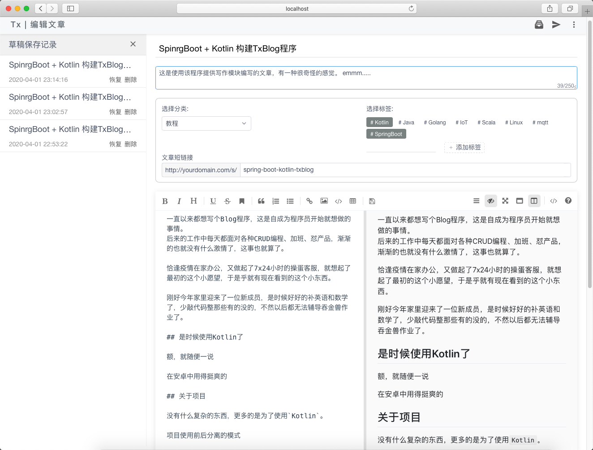
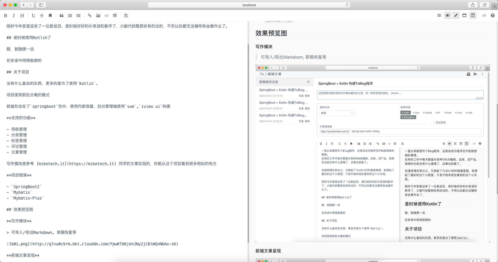
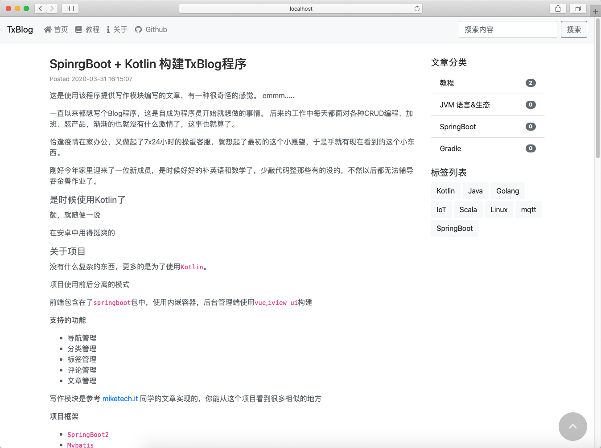

```text
meta-info:
category=教程
tags=[#Kotlin, #SpringBoot]
```

```text
brief:
这是使用该程序提供写作模块编写的文章，有一种很奇怪的感觉。 emmm.....
```

一直以来都想写个Blog程序，这是自成为程序员开始就想做的事情。
后来的工作中每天都面对各种CRUD编程、加班、怼产品，渐渐的也就没有什么激情了，这事也就算了。

恰逢疫情在家办公，又做起了7x24小时的操蛋客服，就想起了最初的这个小愿望，于是乎就有现在看到的这个小东西。

刚好今年家里迎来了一位新成员，是时候好好的补英语和数学了，少敲代码整那些有的没的，不然以后都无法辅导吞金兽作业了。

## 是时候使用Kotlin了

额，就随便一说

在安卓中用得挺爽的

## 关于项目

没有什么复杂的东西，更多的是为了使用`Kotlin`。

项目使用前后分离的模式

前端包含在了`springboot`包中，使用内嵌容器，后台管理端使用`vue`,`iview ui`构建

**支持的功能**

- 导航管理
- 分类管理
- 标签管理
- 评论管理
- 文章管理

写作模块是参考 [miketech.it](https://miketech.it) 同学的文章实现的，你能从这个项目看到很多相似的地方

**项目框架**

- `SpringBoot2`
- `Mybatis`
- `Mybatis-Plus`

## 效果预览图

**写作模块**

> 可导入/导出Markdown, 草稿恢复等



*全屏写作*



**前端文章呈现**


